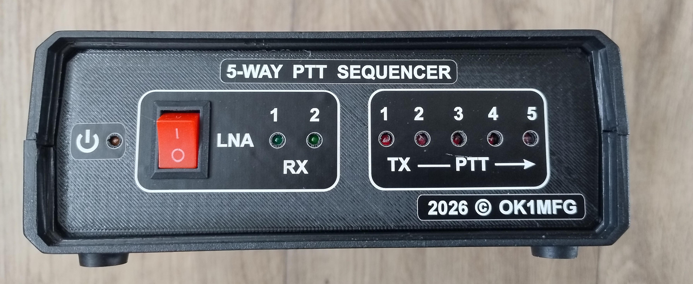
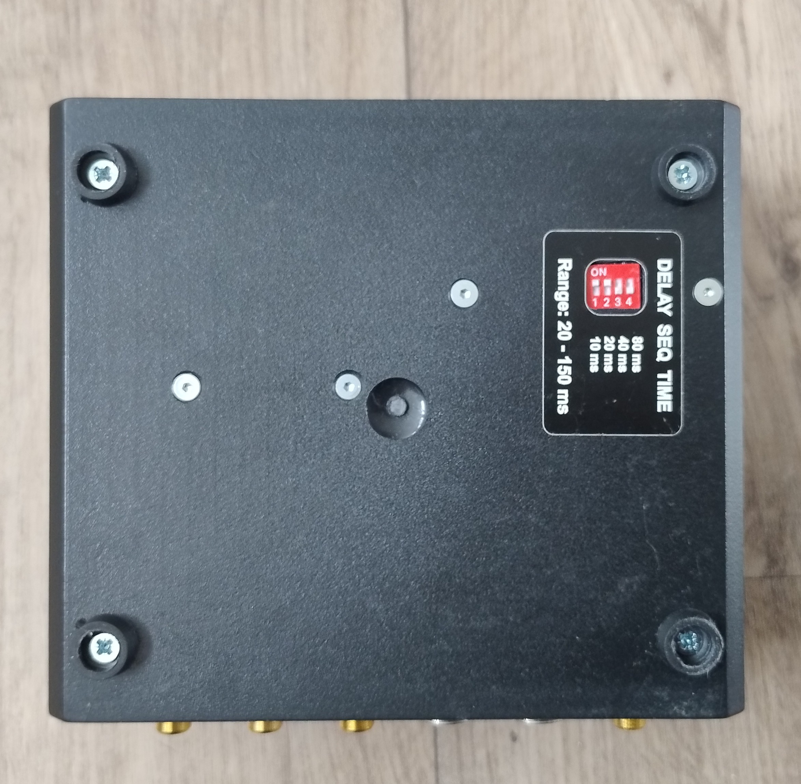
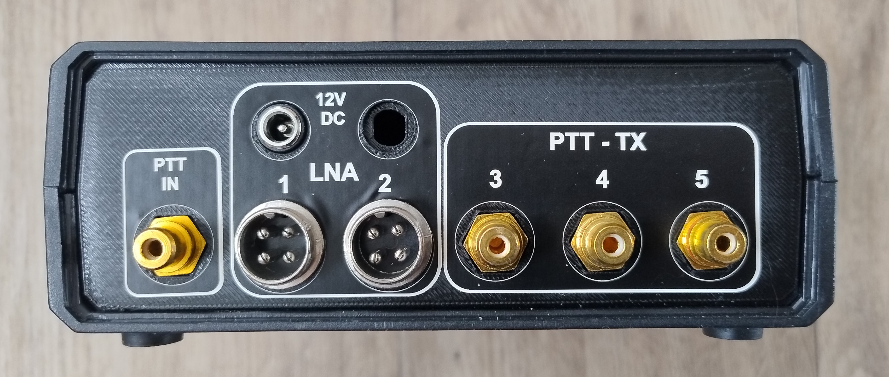
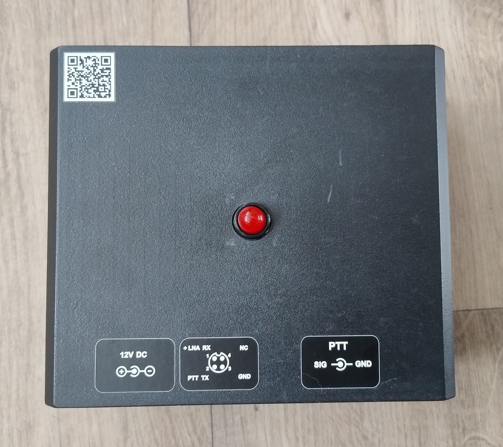
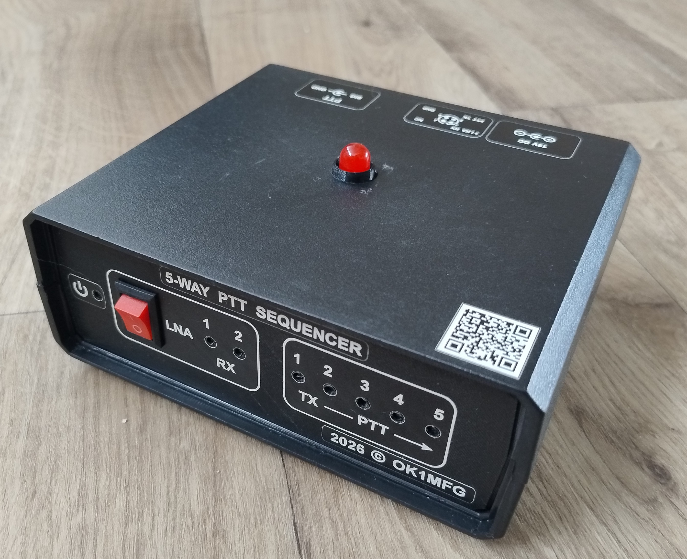
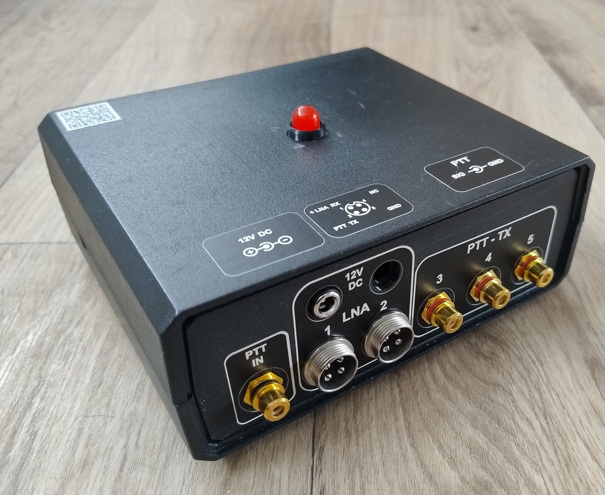

# PTT Sequencer

PTT sequencer pro řízení postupného zapínání a vypínání jednotlivých částí zařízení.



## Princip činnosti

Po aktivaci PTT sequencer postupně aktivuje jednotlivé výstupy s nastaveným časovým odstupem.

```text
PTT IN - ON

PTT 1 → PTT 2 → PTT 3 → PTT 4 → PTT 
```

Po ukončení PTT proběhne vypnutí v opačném pořadí:

```text
PTT IN - OFF

PTT 5 → PTT 4 → PTT 3 → PTT 2 → PTT 1
```

Tím je zajištěno, že jednotlivé části zařízení jsou při přechodu mezi RX a TX zapínány a vypínány v definovaném pořadí.

## Zapojení 1 kanálu PTT


## Nastavení časového kroku

Časový odstup mezi jednotlivými kroky se nastavuje pomocí DIP přepínačů na spodni straně krabičky.

Nastavením kombinace přepínačů lze zvolit požadovanou rychlost sekvence podle použitého zařízení.



## Zadní panel

Na zadním panelu jsou umístěny vstupy a výstupy pro připojení zarizeni.



### PTT IN

Vstup pro ovládací PTT signál (šlapka).

Po aktivaci vstupu se spustí zapínací sekvence. Po jeho uvolnění proběhne vypínací sekvence v opačném pořadí.

### LNA / PTT-TX

Výstupy sequenceru pro jednotlivé řízené stupně.

Jednotlivé výstupy jsou aktivovány postupně podle nastaveného časového kroku.

## Ovládání LNA ( vypínač)

Na předním panelu je samostatný vypínač **LNA**.

Vypínač **LNA odpojuje napájení pouze pro předzesilovače (LNA)**. Nemá vliv na napájení ostatních částí zařízení.


## Indikace

LED indikace na předním panelu informuje o aktivním stavu sekvence.

Během přechodu do TX a návratu do RX probíhá sekvence automaticky podle nastaveného časového kroku.

## Konstrukce

Sequencer je umístěn v kompaktní skříňce s ovládacími prvky na předním panelu a konektory pro připojení na zadním panelu.

[KiCAD](https://github.com/DrumClock/OK1MFG/tree/main/Sequencer/KiCaD)
- schéma a PCB


 [FreeCAD](https://github.com/DrumClock/OK1MFG/tree/main/Sequencer/FreeCAD)
  - přední a zadní panel




## Přehled projektu

Součástí projektu jsou také konstrukční podklady PCB a čelního panelu.





---
